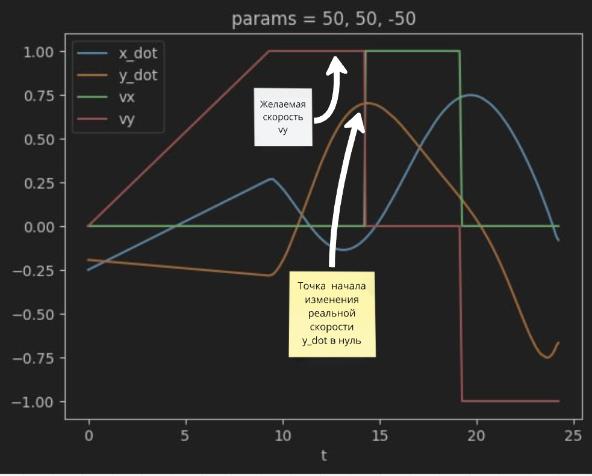

# SwarmControl

## Установка последней версии

```python
pip install git+https://github.com/OnisOris/SwarmControl
```

## Файл настроек
В корне репозитория есть файл с конфигурацией. Ее нужно использовать при создании объекта Drone, где из конфигурации
берется период задержки забора координат period_get_xyz, период задержки отправки вектора скорости period_send_v при 
управлении по скоростям. 

Параметры: height, lenght, width - высота, длина, ширина дрона.

Через параметр rot_get_pos можно повернуть глобальную систему координат. При этом положительное направление - против
часовой стрелки.
Часто приходится вращать и управляющие вектора или желаемые координаты, параметр rot_send_U вращает их, положительное 
направление - также против часовой стрелки.
Обратитите внимание на trajectory_write, если этот параметр включен, реальная траектория дрона будет записываться в поле
traj у объекта класса Drone.
Если при использовании полета по точкам  в поле trajectory сохраняются желаемые координаты при использовании метода
goto([x, y, z]), то при управлении по скоростям записываются реальные коордианаты с локуса и управляющие скорости.
Очень важно обратить внимание на то, что скорости не могут изменяться мгновенно, объекты имеют массу, из-за которой
невозможно сразу разонать дрон до нужной скорости в 1 м/с. График ниже наглядно это показывает.


```python
from numpy import pi
CONFIG = {
    'standard_port': 5656,
    'trajectory_write': True,
    'ip_3': '10.1.100.',
    'num_drone': 105,
    'period_send_v': 0.05,
    'period_get_xyz': 0.05,
    'height': 0.12,
    'lenght': 0.29,
    'width':  0.29,
    'rot_get_pos': 0,
    'rot_send_U': -pi/2
}
```

## Примеры использования
В начале работы создайте config файл в своей папке с проектом и импортируйте его в проект, либо можете просто создать 
словарь в своем основном коде.
### Полет в бесконечность

```python
from SwarmControl.swarmsys import *
from pioneer_sdk import Pioneer
import time
from config import CONFIG
num = CONFIG['standard_port']
drone = Pioneer(ip=f"{CONFIG['ip_3']}{CONFIG['num_drone']}", mavlink_port=CONFIG['standard_port'])
dr = Drone(CONFIG, drone=drone)
dr.arm()
dr.takeoff(1.5) # height - высота взлета 
time.sleep(7)
dr.set_coord_check() # запускает запись координат в traj отдельным потоком
dr.set_v() # запускает отсылку вектора скорости дрону отдельным потоком
dr.speed_change([-1, 1, 0]) # метод для отправки вектора скорости дрону
```

### Облет двух точек
Будет полезно, чтобы понимать, правильно ли у нас заданы системы координат. Не забывать в goto использовать apply=True,
если вы летаете в реальном дроне, а не строите графики.

```python
from SwarmControl.swarmsys import *
from pioneer_sdk import Pioneer
from config import CONFIG

num = CONFIG['standard_port']
drone = Pioneer(ip=f"{CONFIG['ip_3']}{CONFIG['num_drone']}", mavlink_port=CONFIG['standard_port'])
dr = Drone(CONFIG, drone=drone)

dr.arm()
dr.takeoff()
dr.wait_point = True # 
dr.goto([-3, -3, 1.5], apply=True)
dr.goto([3, 3, 1.5], apply=True)
```

### Управление через джостик и снятие дланных о пропадании сигнала с локуса
Управление ведется в глобальной системе координат локуса. 

Для подключения следуйте инструкции с картинки


После этого можно выполнять код ниже. Данный пример показывает, как включить управление с контроллера.
```python
from SwarmControl.swarmsys import *
from pioneer_sdk import Pioneer
from config import CONFIG

pioneer = Pioneer(ip="10.1.100.105", mavlink_port=5656, logger=False)
drone = Drone(CONFIG, drone=pioneer, apply=True, joystick_on=True)
drone.arm()
drone.takeoff(1.8)
drone.set_coord_check()
drone.set_v()
drone.xyz_flag = True
drone.set_coord_check()
```

Если в конце полета вы зажмете правый трехзначный переключатель вниз, то данные полета сохранятся в ./data.csv. 
Обработать данные можно через следующий пример:

```python
import numpy as np
import matplotlib as mpl
mpl.use('Qt5Agg')
import pandas as pd
from ThreeDTool import Up, Dspl
from SwarmControl.plotBuilder import zero_check

df = pd.read_csv('./data.csv', index_col=0)
up = Up(df[['x', 'y', 'z']], 'plot')
up_zeros = Up([[0, 0, 0]])
up_not_zeros = Up([[0, 0, 0]])

for i, obj in enumerate(up):
    if i == 0:
        continue
    elif i == up.shape[-2]:
        break
    if np.allclose(obj, [0., 0., 0.], 1e-8):
        point = zero_check(up, i)
        up_zeros = np.vstack([up_zeros, point])
    else:
        up_not_zeros = np.vstack([up_not_zeros, obj])
up_zeros = Up(up_zeros)
up_not_zeros = Up(up_not_zeros, 'plot')
up_zeros.color = "red"
up_zeros.s = 50
dp = Dspl([up_not_zeros, up_zeros])
dp.show()
```
В результате мы получаем трехмерный график ниже на картинке. Зеленые точки - нормальные координаты, красные - там, где 
они были равны нулевой точке 


